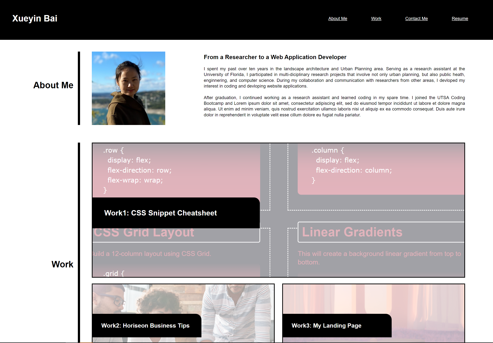
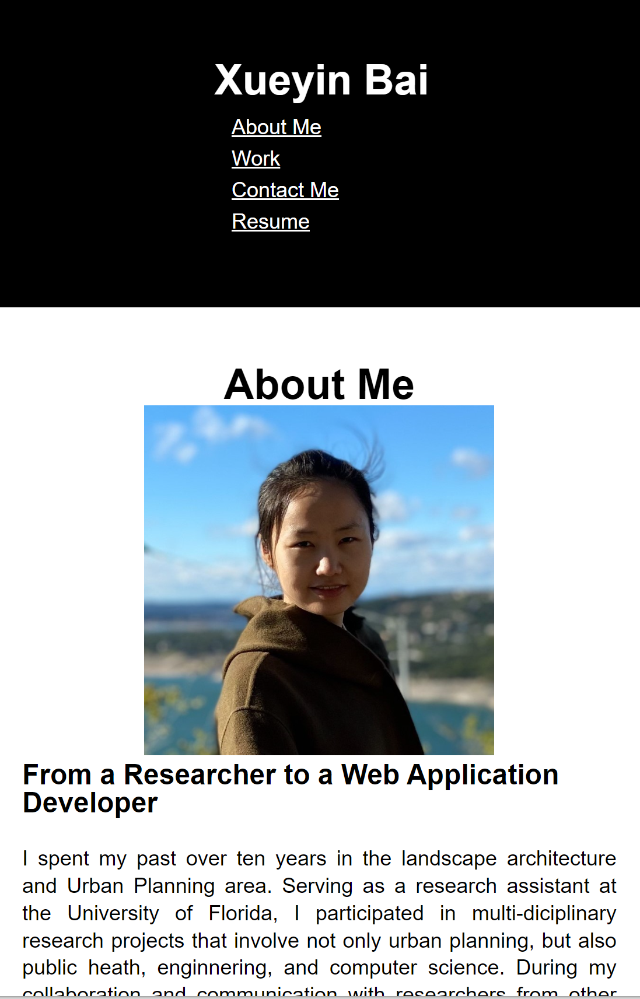

# module2_challenge_professional-portfolio

## Description

This webstie is Xueyin's professional portfolio. It contains three main sections: 
1. About Me: basic information about Xueyin.

2. Work: applications developed by Xueyin.

3. Contact Me: Xueyin's contact information.

## Installation

N/A

## Usage

* Users can click the navagation bar at the up right corner to scroll to the corresponding section.

* Clicking the "Work" section brings users to the titled images of the applications developed by Xueyin.

* When users click on one of the images, they are taken to the corresponding application.

## Sreenshot

The following image demonstrates the website appearance:

## Link to the website

https://xybai0103.github.io/module2_challenge_professional-portfolio/

## Credits

N/A

## Licencse

N/A